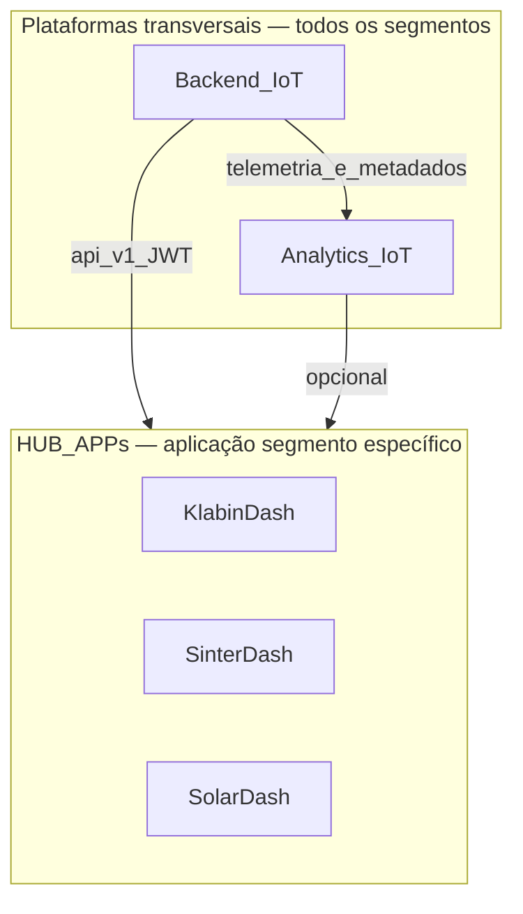
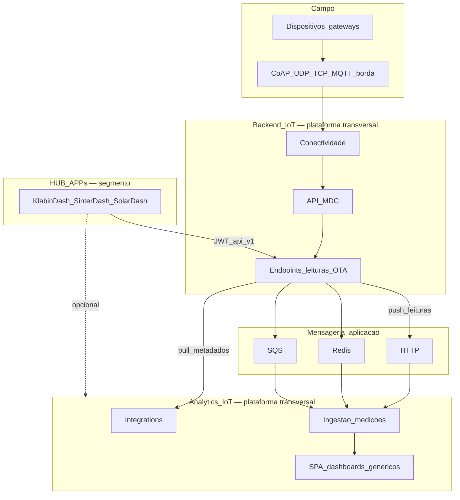

# Ecossistema OneRF

One-pager: as **três camadas de produto** OneRF — duas plataformas transversais e apps segmentadas (HUB APPs).

**Visão completa:** [platform/PLATFORM_VISION.md](platform/PLATFORM_VISION.md)  
**Integração Backend IoT ↔ Analytics IoT:** [platform/INTEGRATION_PATTERNS.md](platform/INTEGRATION_PATTERNS.md) · contrato concreto em [backend/docs/INTEGRATION_ANALYTICS.md](../backend/docs/INTEGRATION_ANALYTICS.md)

---

## 1. Modelo de produto

| Camada | O quê | Transversal? | Repo |
|--------|-------|:------------:|------|
| **Backend IoT** | Gestão de **conectividade e dispositivos** IoT — gateways, endpoints, protocolos de campo (CoAP, MQTT na borda), leituras, OTA, API MDC | **Sim** — qualquer segmento (utilities, industrial, solar, …) | [`backend`](../backend/) (`onerf_appapi`) |
| **Analytics IoT** | **Análise de dados IoT genérica** — inventário canônico, séries temporais, dashboards configuráveis, ocorrências, multi-org | **Sim** — qualquer segmento | [`b2b_analytics`](../b2b_analytics/) |
| **HUB APPs** | Conjuntos de **dashboards e análises simples** para uma **aplicação/segmento** determinado | **Não** — uma app por vertical | [KlabinDash](../KlabinDash/), [SinterDash](../SinterDash/), [SolarDash](../SolarDash/) · catálogo [AppHub](../AppHub/) |

**Narrativa:** segmentos operam dispositivos via **Backend IoT**; consolidam e exploram telemetria via **Analytics IoT**; operadores de um caso concreto (Klabin, sinterização, FV) usam **HUB APPs** focadas, consumindo as plataformas por API.

---

## 2. Posicionamento — o que cada camada é e não é

| Camada | Responsabilidade | Não é |
|--------|------------------|-------|
| **Backend IoT** | Conectividade, inventário de campo, protocolos, MDC, jobs operacionais, exportações por cliente | Plataforma analítica genérica; dashboard segmentado |
| **Analytics IoT** | Hub multi-fonte, Influx, dashboards genéricos, ocorrências, SPA B2B multi-org | Substituto do headend de conectividade; app de um único segmento |
| **HUB APPs** | UX e regras de negócio **do segmento** (estufas, linhas, inversores); metadado local; painéis simples | Plataforma transversal; substituto do Backend ou do Analytics |

---

## 3. Diagrama de fluxo

---

## 4. Princípios

1. **Backend IoT = plataforma de conectividade** — fonte operacional de dispositivos; atende **todos** os segmentos.
2. **Analytics IoT = plataforma de análise genérica** — modelo canônico, séries, orgs; atende **todos** os segmentos.
3. **HUB APPs = camada segmentada** — compõem dashboards simples sobre as plataformas; **não** duplicam conectividade nem hub analítico completo.
4. **Duas camadas de protocolo** — campo (CoAP, UDP, MQTT na borda) termina no Backend IoT; integração Backend ↔ Analytics usa **HTTP / Redis / SQS** ([ADR-001](adr/001-no-mqtt-inter-system.md)).
5. **Identidade estável** — ObjectId do endpoint no Backend IoT = `sourceDeviceId` no Analytics IoT.

---

## 5. Consumidores das plataformas

| Consumidor | Plataforma usada | Uso |
|------------|------------------|-----|
| **Analytics IoT** | Backend IoT | Pull metadados + push leituras |
| **HUB APPs** | Backend IoT (primário) | Leituras e endpoints via JWT `/api/v1` |
| **HUB APPs** | Analytics IoT (opcional) | Séries / inventário quando aplicável |
| **Operadores OneRF** | Backend IoT | UI operacional (EJS), mapas, OTA |
| **Distribuidoras / multi-org** | Analytics IoT | SPA B2B, dashboards genéricos |
| **Gateways / dispositivos** | Backend IoT | CoAP, UDP, MQTT, autoconfig |

---

## 6. HUB APPs — catálogo actual

| App | Segmento | Repo | Path |
|-----|----------|------|------|
| **KlabinDash** | Secagem de papel — umidade em estufas | [KlabinDash](../KlabinDash/) | `/apps/klabindash/` |
| **SinterDash** | Linhas de produção industrial | [SinterDash](../SinterDash/) | `/apps/sinterdash/` |
| **SolarDash** | Inversores solares / Modbus | [SolarDash](../SolarDash/) | `/apps/solardash/` |
| **AppHub** | Catálogo de HUB APPs | [AppHub](../AppHub/) | `/apps/` |

Detalhe: [products/hub-apps/README.md](products/hub-apps/README.md).

---

## 7. Leituras recomendadas

| Tema | Documento |
|------|-----------|
| Taxonomia + padrão B2B técnico | [platform/PLATFORM_VISION.md](platform/PLATFORM_VISION.md) |
| Contrato HTTP | [platform/API_CONTRACT.md](platform/API_CONTRACT.md) |
| Backend IoT | [products/backend-iot/README.md](products/backend-iot/README.md) |
| Analytics IoT | [products/analytics/README.md](products/analytics/README.md) |
| HUB APPs | [products/hub-apps/README.md](products/hub-apps/README.md) |

---

*Última actualização: jun/2026 — Backend IoT + Analytics IoT (transversais) + HUB APPs (segmento).*
