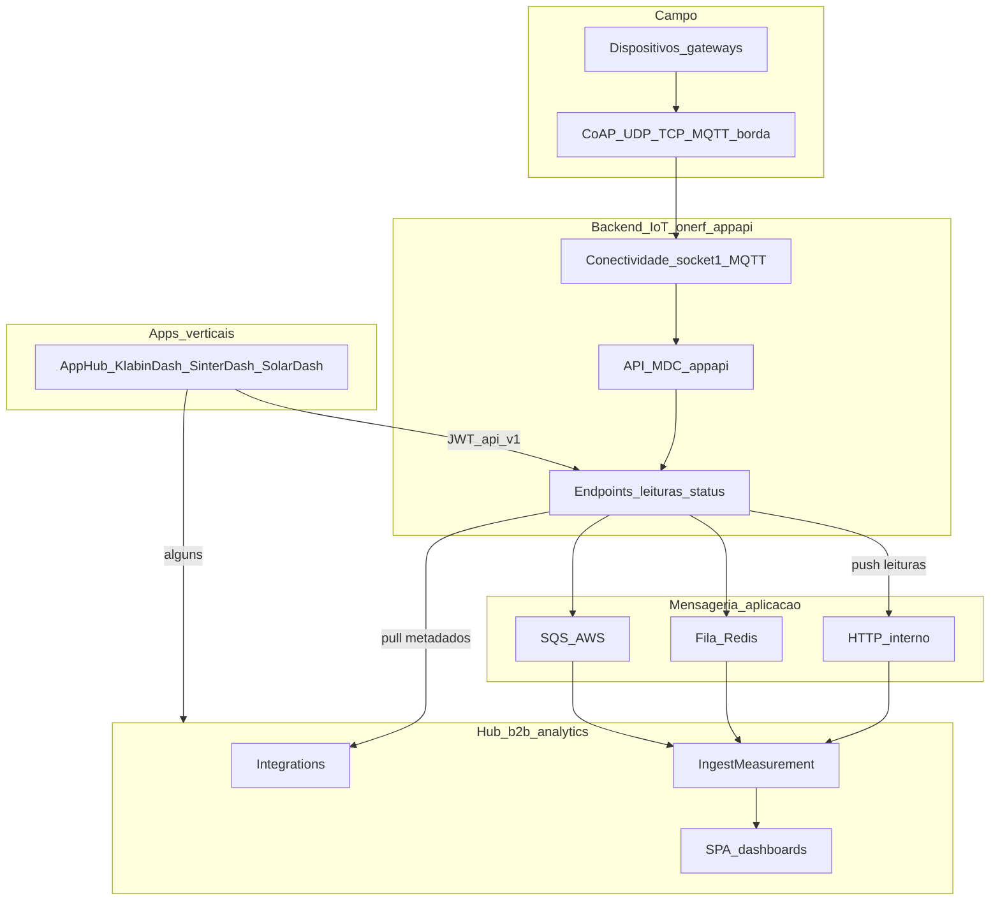

# Ecossistema OneRF

One-pager: posicionamento dos produtos OneRF em relação uns aos outros e aos clientes.

**Visão de plataforma:** [platform/PLATFORM_VISION.md](platform/PLATFORM_VISION.md)  
**Integração Backend ↔ Analytics:** [platform/INTEGRATION_PATTERNS.md](platform/INTEGRATION_PATTERNS.md) · contrato concreto em [backend/docs/INTEGRATION_ANALYTICS.md](../backend/docs/INTEGRATION_ANALYTICS.md)

---

## 1. Resumo executivo

O ecossistema OneRF separa responsabilidades principais:

1. **Backend IoT OneRF (`onerf_appapi`)** — conectividade de campo, gateways, endpoints, protocolos (CoAP, UDP, TCP, MQTT na borda), normalização operacional, API MDC, jobs de leitura/OTA e **publicação de telemetria** para consumidores internos.
2. **B2B Analytics IoT (`b2b_analytics`)** — hub analítico multi-tenant: sensores canônicos, Influx, dashboards, ocorrências, integrações multi-fonte.
3. **Dashboards verticais** (KlabinDash, SinterDash, SolarDash, …) — SPAs especializadas servidas em `/apps/`, consumindo API IoT e/ou hub via JWT.

O backend **não substitui** o hub analítico. O Analytics **não substitui** o broker MQTT nem a stack de conectividade em tempo real de campo.

---

## 2. Posicionamento de produto

| Produto | Responsabilidade | Não é |
|---------|------------------|-------|
| **OneRF Backend IoT** | Dispositivos, gateways, MDC, protocolos de campo, leituras, OTA, exportações por cliente (Enel, CPFL, …) | Dashboard B2B multi-org, SLAs de ocorrência, analytics de longo prazo |
| **B2B Analytics IoT** | Hub multi-fonte, Influx, ocorrências, SPA para distribuidoras/plantas | Substituto do MDC em tempo real de campo |
| **Apps verticais `/apps/`** | Painéis operacionais por cliente/indústria | Substituto do hub nem do headend |

**Narrativa:** a planta opera dispositivos via backend IoT; a visão analítica consolidada vive no Analytics, alimentada por pull de metadados e push de leituras; operadores industriais podem usar dashboards verticais focados.

---

## 3. Diagrama de ecossistema

---

## 4. Princípios

1. **Backend IoT = fonte operacional** — endpoints, comunicação, credenciais de campo, telemetria outbound.
2. **Analytics = hub de valor** — modelo canônico (`integrationId` + `sourceDeviceId`), séries, orgs, ocorrências.
3. **Duas camadas de protocolo** — campo (CoAP, UDP, MQTT na borda) termina no backend; integração Backend ↔ Analytics usa **JSON sobre mensageria de aplicação** (HTTP, Redis, SQS) — **não** MQTT como barramento padrão ([ADR-001](adr/001-no-mqtt-inter-system.md)).
4. **Identidade estável** — ObjectId do endpoint no backend = `sourceDeviceId` no hub; o backend publica esse id, não o `_id` do sensor Analytics.
5. **Velocidades diferentes** — metadados: pull batch (job no Analytics); leituras: push event-driven.

---

## 5. Consumidores do backend IoT

| Consumidor | Uso | Direção |
|------------|-----|---------|
| **b2b_analytics** | Discover/register/sync sensores; ingestão de medições | Pull API + push fila |
| **Operadores OneRF** | UI EJS — endpoints, gateways, mapas, OTA | HTTP sessão |
| **Integrações API** | Automação, dashboards externos, MDC clients | JWT `/api/v1` |
| **Clientes (Enel, CPFL, …)** | Exportações SGE, jobs custom | Jobs + arquivos |
| **Gateways / dispositivos** | CoAP, UDP, MQTT, autoconfig | Protocolos de campo |
| **Dashboards verticais** | Leituras e metadados por endpoint | JWT `/api/v1` |

---

## 6. Leituras recomendadas

| Tema | Documento |
|------|-----------|
| Plataforma B2B | [platform/PLATFORM_VISION.md](platform/PLATFORM_VISION.md) |
| Contrato HTTP | [platform/API_CONTRACT.md](platform/API_CONTRACT.md) |
| Backend IoT (repo) | [products/backend-iot/README.md](products/backend-iot/README.md) |
| Analytics (repo) | [products/analytics/README.md](products/analytics/README.md) |
| Apps `/apps/` | [products/vertical-apps/README.md](products/vertical-apps/README.md) |

---

*Última actualização: jun/2026 — consolidado a partir de `backend/docs/ECOSYSTEM.md`.*
