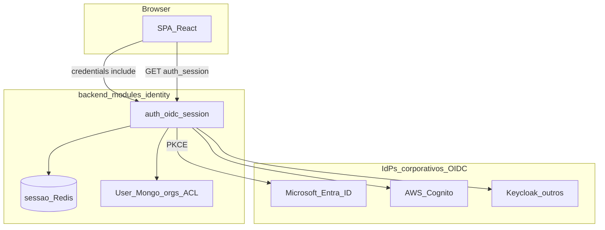

# Autenticação e autorização — OIDC

Decisão fechada da [OneRF B2B Platform](PLATFORM_VISION.md). Detalhe de implementação: [b2b_analytics/docs/ARCHITECTURE_TARGET.md §8](../../../b2b_analytics/docs/ARCHITECTURE_TARGET.md).

---

## 1. Resumo

| Fluxo | Mecanismo |
|-------|-----------|
| **Humano (browser)** | OIDC multi-IdP + sessão HTTP (BFF); tokens OIDC **não** expostos ao browser |
| **SPA bootstrap** | `GET /api/v1/auth/session` (user, org, nav, roles) |
| **M2M / integrações** | `POST /token` ou client credentials → JWT |
| **Autorização** | ACL no app (Mongo) — **não** delegada ao IdP |

---

## 2. Fluxo web (humano)

- **Protocolo:** OIDC/OAuth2 — Authorization Code + **PKCE**; redirect via backend.
- **IdPs:** Microsoft Entra ID, AWS Cognito, Keycloak, Google Workspace — **configurável por org**.
- **Sessão:** `express-session` + Redis; cookie `httpOnly`, `sameSite=lax`, `secure` em HTTPS.
- **SPA:** `fetch`/`axios` com `credentials: 'include'`.
- **Provisioning:** JIT na 1ª login OIDC; admin associa orgs; **ACL Mongo = fonte de verdade**.
- **Login local:** email/senha opcional por org (`oidc` | `local` | `hybrid`) — dev/homolog.

---

## 3. Multi-org

- `currentOrg` na sessão app.
- ACL e filtros de listagem respeitam a org activa.
- Claims OIDC isolados **não** substituem a org da sessão.

---

## 4. Integrações M2M

- `POST /token` ou client credentials OIDC → JWT app.
- Rotas `/api/v1` aceitam `Authorization: Bearer` — fluxo **separado** do login humano.

**Apps verticais (legado):** ver [HUB APPs](../../onerf-platform-docs/products/hub-apps/README.md) — KlabinDash, SinterDash, SolarDash consomem tipicamente JWT M2M com token em `localStorage` — padrão transitório até SSO unificado.

---

## 5. Local alvo no código

| Peça | Pasta |
|------|-------|
| Módulo identity | `backend/modules/identity/` |
| Rotas auth | `/api/v1/auth/*` |
| Middleware ACL | router `/api/v1` antes dos handlers |

**Transitório:** Passport local + pasta `base/` no Analytics — ver [REFACTOR_BREAKING.md](../../../b2b_analytics/docs/REFACTOR_BREAKING.md).

---

*Última actualização: jun/2026 — ADR OIDC; migrado de PLATFORM_VISION §8.1.*
