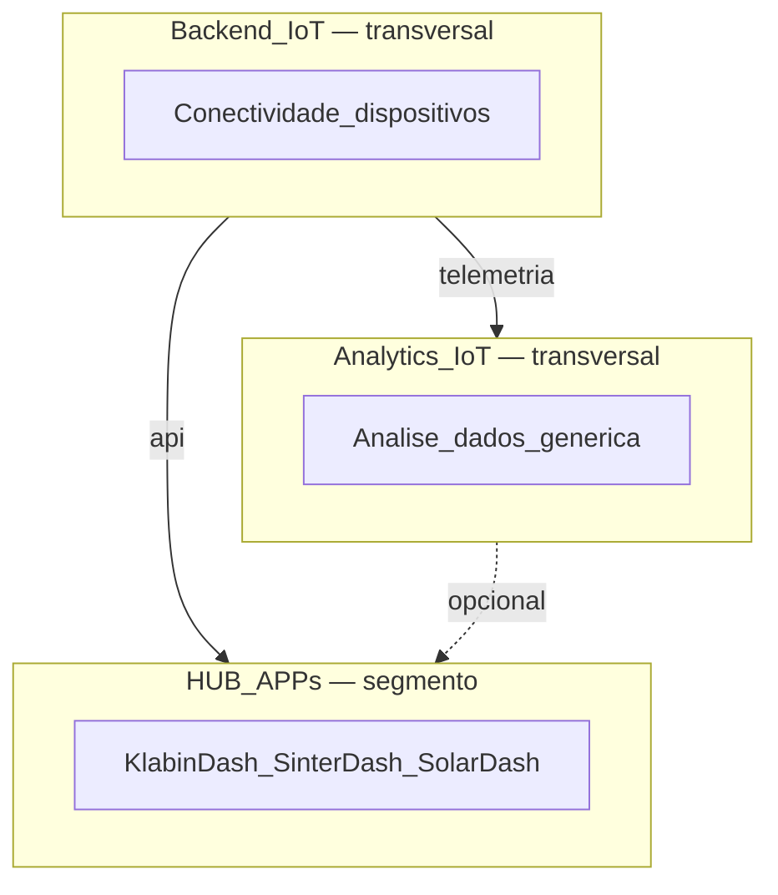
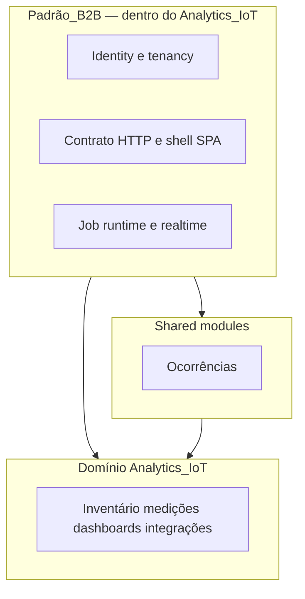

# OneRF — visão estruturante

Documento **estruturante** do ecossistema OneRF: **plataformas transversais**, **HUB APPs segmentadas** e **padrão técnico B2B** (entrega multi-org). Não é manual de operação nem guia de deploy.

**Ecossistema (diagramas):** [ECOSYSTEM.md](../ECOSYSTEM.md)  
**Público:** liderança de software, arquitetos e devs que definem o **alvo** antes da execução.

---

## 1. Terminologia — produtos do ecossistema

| Termo | Significado |
|-------|-------------|
| **Backend IoT** | Plataforma **transversal** de gestão de **conectividade e dispositivos** IoT — gateways, endpoints, protocolos de campo, MDC, OTA. Repo: `onerf_appapi`. |
| **Analytics IoT** | Plataforma **transversal** de **análise de dados IoT genérica** — inventário canônico, Influx, dashboards configuráveis, ocorrências, multi-org. Repo: `b2b_analytics`. |
| **HUB APPs** | Conjuntos de **dashboards e análises simples** para um **segmento/aplicação** específico (ex.: KlabinDash, SinterDash, SolarDash). **Não** são transversais. |
| **OneRF B2B Platform** | Padrão **técnico** de entrega multi-org (identity, HTTP, shell SPA, jobs) — aplicado sobretudo no Analytics IoT; referência para evolução do Backend IoT. **Não** é um repo. |
| **Shared module** | Bounded context reutilizável (ex.: ocorrências) dentro de um monorepo de plataforma. |
| **`application` (camada)** | Use cases — **não** confundir com produto de ecossistema. |

**Regra:** Backend IoT e Analytics IoT servem **todos os segmentos**; HUB APPs consomem-nas por API e acrescentam UX/regras **do segmento**.

---

## 2. Modelo em três camadas de produto

| Camada | Repo | Documentação |
|--------|------|--------------|
| Backend IoT | [backend/](../../../backend/) | [products/backend-iot/README.md](../products/backend-iot/README.md) |
| Analytics IoT | [b2b_analytics/](../../../b2b_analytics/) | [products/analytics/README.md](../products/analytics/README.md) |
| HUB APPs | KlabinDash, SinterDash, SolarDash, AppHub | [products/hub-apps/README.md](../products/hub-apps/README.md) |

---

## 3. Padrão técnico B2B *(OneRF B2B Platform)*

Capacidades de **entrega** que o Analytics IoT materializa (e que outras apps B2B OneRF devem seguir ou convergir):

| Área | O que inclui | Documentação |
|------|--------------|--------------|
| Tenancy e identidade | users, orgs, ACL, OIDC, sessão BFF, JWT M2M | [AUTH_OIDC.md](AUTH_OIDC.md) |
| Contrato HTTP | `/api/v1`, camelCase, OpenAPI, `ListResponse` | [API_CONTRACT.md](API_CONTRACT.md) |
| Shell SPA | layout, auth, lista × detalhe | [UI_NAVIGATION.md](UI_NAVIGATION.md) |
| Runtime assíncrono | BullMQ, Redis, Socket.IO | [ARCHITECTURE_TARGET §9](../../../b2b_analytics/docs/ARCHITECTURE_TARGET.md) |
| Ocorrências (shared) | eventos operacionais, SLA | [OCCURRENCES_PLAN](../../../b2b_analytics/docs/OCCURRENCES_PLAN.md) |
| Domínio Analytics IoT | sensores, Influx, dashboards genéricos, MDC/SQS | [products/analytics/README.md](../products/analytics/README.md) |

**Implementação de referência do padrão B2B:** repositório `b2b_analytics`.

---

## 4. HUB APPs vs plataformas

| | Plataforma transversal | HUB APP |
|--|------------------------|---------|
| **Backend IoT** | Inventário e conectividade de **qualquer** dispositivo | Escolhe endpoints/canais **do segmento** |
| **Analytics IoT** | Dashboards e séries **genéricos**, multi-org | Painéis **fixos** e metadado local (estufas, linhas, …) |
| **Evitar** | Regras de um único cliente no core | Reimplementar MDC, Influx ou mesh no app |

---

## 5. Princípios do ecossistema

1. **Duas plataformas transversais** — Backend IoT (conectividade) + Analytics IoT (análise); segmentos não forkam estas bases.
2. **HUB APPs finas** — consomem API; metadado de segmento no repo da app.
3. **Multi-org** (Analytics IoT) — `currentOrg` na sessão; ACL no app.
4. **API-first** — `/api/v1`; OpenAPI por serviço.
5. **Sem MQTT inter-sistema** — Backend ↔ Analytics via HTTP/SQS/Redis ([INTEGRATION_PATTERNS.md](INTEGRATION_PATTERNS.md), [ADR-001](../adr/001-no-mqtt-inter-system.md)).
6. **JSON camelCase** em `/api/v1` ([API_CONTRACT.md](API_CONTRACT.md)).
7. **Segredos fora do Git**.

---

## 6. Decisões estruturantes fechadas

| Decisão | Documento |
|---------|-----------|
| Autenticação OIDC (Analytics IoT / B2B) | [AUTH_OIDC.md](AUTH_OIDC.md) |
| Contrato JSON | [API_CONTRACT.md](API_CONTRACT.md) |
| Integração inter-sistema | [INTEGRATION_PATTERNS.md](INTEGRATION_PATTERNS.md) · [ADR-001](../adr/001-no-mqtt-inter-system.md) |
| UX lista × detalhe | [UI_NAVIGATION.md](UI_NAVIGATION.md) |

---

## 7. Mapa de documentação

| Documento | Conteúdo |
|-----------|----------|
| [README.md](../README.md) | Índice |
| [ECOSYSTEM.md](../ECOSYSTEM.md) | Backend IoT × Analytics IoT × HUB APPs |
| **Este arquivo** | Terminologia, camadas de produto, padrão B2B |
| [products/backend-iot/](../products/backend-iot/README.md) | Plataforma conectividade |
| [products/analytics/](../products/analytics/README.md) | Plataforma análise |
| [products/hub-apps/](../products/hub-apps/README.md) | Apps segmentadas |
| [platform/](.) | Contratos transversais (HTTP, auth, UX, integração) |
| [adr/](../adr/) | ADRs |

---

*Última actualização: jun/2026 — Backend IoT + Analytics IoT (transversais) + HUB APPs (segmento).*
