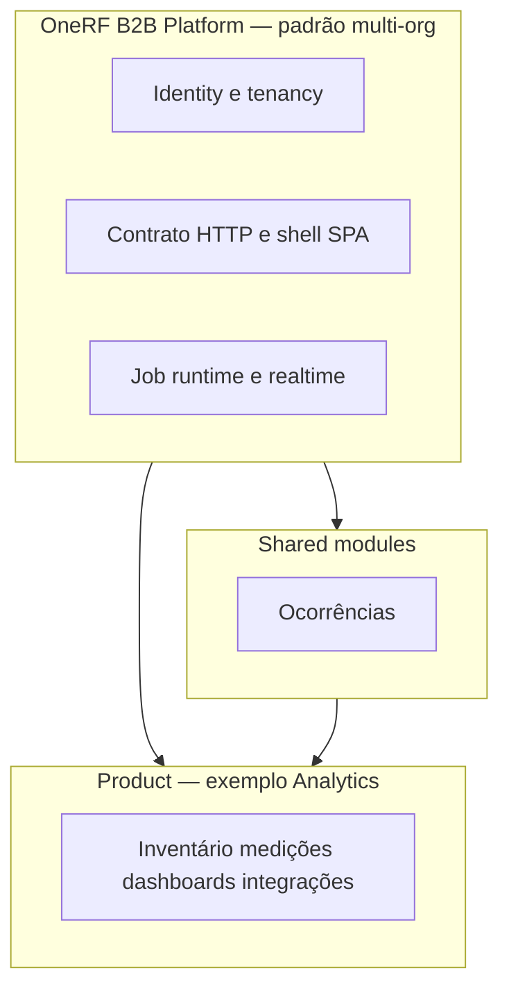

# OneRF B2B Platform — visão estruturante

*Padrão multi-org para aplicações B2B OneRF.*

Documento **estruturante**: define o **padrão de plataforma** reutilizável e onde cada **produto** se encaixa. Não é manual de operação, guia de deploy nem documentação de regras operacionais de módulos.

**Implementação de referência:** repositório `b2b_analytics` — ver [products/analytics/README.md](../products/analytics/README.md).

**Público:** liderança de software, arquitetos e devs que definem o **alvo** antes da execução.

**Ecossistema:** [ECOSYSTEM.md](../ECOSYSTEM.md) · **Detalhe técnico de implementação:** [b2b_analytics/docs/ARCHITECTURE_TARGET.md](../../../b2b_analytics/docs/ARCHITECTURE_TARGET.md).

---

## 1. Terminologia

| Termo | Significado |
|-------|-------------|
| **OneRF B2B Platform** | Padrão de entrega para apps B2B multi-tenant OneRF — identity, contrato HTTP, shell SPA, runtime assíncrono. **Não** é pasta, pacote npm nem repo copiável. |
| **Shared module** | Bounded context reutilizável entre produtos OneRF (ex.: ocorrências). Vive em `backend/modules/<nome>/`. |
| **Product** | Core domain **de um repositório** — ex.: inventário analítico no Analytics; gateways/endpoints no Backend IoT. |
| **`application` (camada)** | Use cases em `backend/application/` — **não** confundir com “Product”. |
| **`base/` (pasta)** | Legado transitório do refactor Analytics. Mencionar **só** ao descrever código actual; absorver em `backend/modules/identity/`. |

**Regra:** recursos de plataforma e shared modules são **módulos e convenções dentro do monorepo de cada produto**; o produto Analytics ocupa `backend/domain`, `backend/application` e rotas `api_*` de domínio analítico.

---

## 2. Modelo em três camadas

### 2.1 OneRF B2B Platform *(padrão multi-org)*

Capacidades que **qualquer** app B2B OneRF de referência deve oferecer ou seguir:

| Área | O que inclui | Local alvo | Documentação |
|------|--------------|------------|--------------|
| **Tenancy e identidade** | users, orgs, `current_org`, perfil, ACL, OIDC multi-IdP, sessão BFF, JWT M2M | `backend/modules/identity/` | [AUTH_OIDC.md](AUTH_OIDC.md) |
| **Contrato HTTP** | `/api/v1`, erros JSON, **camelCase**, OpenAPI, `ListResponse` | `backend/http`, `backend/routes`, `presenter/` | [API_CONTRACT.md](API_CONTRACT.md) |
| **Shell SPA** | layout, auth provider, rotas públicas, login (alvo), `auth/session` | `frontend/src/app/`, `frontend/src/components/` | [UI_NAVIGATION.md](UI_NAVIGATION.md) |
| **UX transversal** | lista × detalhe, listas server-side | shell + UI_NAVIGATION | UI_NAVIGATION |
| **Runtime assíncrono** | BullMQ, Redis, API `/api/v1/jobs`, workers | `backend/infra` | ARCHITECTURE_TARGET §9 (Analytics) |
| **Tempo real (transporte)** | Socket.IO, adapter Redis | `backend/infra` | ARCHITECTURE_TARGET §9 |

Novas capacidades de plataforma entram como **convenções** ou, quando forem módulos encapsulados, em `backend/modules/` apenas se forem claramente transversais (ex.: identity).

### 2.2 Shared modules

Domínios **empacotados para reutilizar** entre produtos OneRF — nem todo app precisa de todos:

| Módulo | Responsabilidade | Local alvo | Documentação |
|--------|------------------|------------|--------------|
| **Ocorrências** | Eventos operacionais, SLA, dedupe, notificações | `backend/modules/occurrences/` | [b2b_analytics/docs/OCCURRENCES_PLAN.md](../../../b2b_analytics/docs/OCCURRENCES_PLAN.md) |

Regras de **produto/operador** de um shared module ficam no plano do módulo — não neste documento.

### 2.3 Product — Analytics *(exemplo principal)*

Capacidades que definem o **hub analítico IoT** — não são obrigatórias em outros apps OneRF:

| Área | O que inclui | Documentação |
|------|--------------|--------------|
| **Inventário** | sensores, planos, unidades, tags multi-org | [products/analytics/README.md](../products/analytics/README.md) |
| **Medições** | Influx, séries, gaps, agregações | ARCHITECTURE_TARGET §10 |
| **Dashboards** | custom dashboards, home, analytics, mapas | UI_NAVIGATION §5 (catálogo Analytics) |
| **Integrações analíticas** | MDC, SQS, importações | [INTEGRATION_PATTERNS.md](INTEGRATION_PATTERNS.md) |

**Posicionamento:** hub multi-tenant para **operar e analisar** telemetria e metadados; **não** substitui conectividade IoT na borda. Sistemas de campo (`onerf_appapi`) **publicam** para o hub via HTTP/SQS — ver INTEGRATION_PATTERNS.

**Tipos de job** = produto; **fila/worker BullMQ** = plataforma (§2.1).

---

## 3. Princípios da plataforma

1. **Multi-org na sessão** — `currentOrg` na sessão app; ACL e filtros respeitam a org activa.
2. **API-first** — operações em `/api/v1`; contrato OpenAPI por serviço; breaking change só com nova versão major.
3. **SPA única** — React no mesmo host; sem EJS de negócio, sem Webpack legado, sem `window.__GLOBALS__`.
4. **Camadas explícitas** — `domain` → `application` → `infra`; rotas HTTP finas.
5. **Autenticação OIDC federada** — multi-IdP + sessão BFF + `GET /api/v1/auth/session`; JWT M2M separado. Detalhe: [AUTH_OIDC.md](AUTH_OIDC.md).
6. **Identidade encapsulada** — `backend/modules/identity/`.
7. **Jobs em BullMQ** — Redis; Agenda descontinuada.
8. **Tempo real via Socket.IO** — adapter Redis para escala horizontal.
9. **Navegação previsível** — lista × detalhe em rotas separadas ([UI_NAVIGATION.md](UI_NAVIGATION.md)).
10. **Listas server-side** — envelope `ListResponse` em índices.
11. **JSON camelCase** em `/api/v1`. Detalhe: [API_CONTRACT.md](API_CONTRACT.md).
12. **Segredos fora do Git** — `.env` para credenciais.
13. **Sem MQTT inter-sistema** — HTTP/SQS/Redis entre apps OneRF. Detalhe: [INTEGRATION_PATTERNS.md](INTEGRATION_PATTERNS.md), [ADR-001](../adr/001-no-mqtt-inter-system.md).

---

## 4. Camadas técnicas (ortogonal às três camadas)

| Camada | Papel | Pasta típica |
|--------|-------|--------------|
| Domain | regras e entidades | `backend/domain` ou `backend/modules/*` |
| Application | use cases, event handlers | `backend/application` |
| Infrastructure | HTTP, Mongo, Influx, Redis, AWS | `backend/infra`, `backend/routes`, `backend/http` |

---

## 5. Decisões estruturantes fechadas

Não reabrir em grooming — detalhe nos documentos linkados e ADRs.

| Decisão | Documento |
|---------|-----------|
| Autenticação OIDC | [AUTH_OIDC.md](AUTH_OIDC.md) |
| Contrato JSON camelCase | [API_CONTRACT.md](API_CONTRACT.md) |
| Integração inter-sistema (sem MQTT) | [INTEGRATION_PATTERNS.md](INTEGRATION_PATTERNS.md) · [ADR-001](../adr/001-no-mqtt-inter-system.md) |
| UX lista × detalhe | [UI_NAVIGATION.md](UI_NAVIGATION.md) |

---

## 6. Mapa de documentação

### Plataforma (este repo)

| Documento | Conteúdo |
|-----------|----------|
| [README.md](../README.md) | Índice de entrada |
| **Este arquivo** | Taxonomia Platform / Shared / Product |
| [ECOSYSTEM.md](../ECOSYSTEM.md) | Backend × Analytics × apps verticais |
| [UI_NAVIGATION.md](UI_NAVIGATION.md) | Convenções shell SPA |
| [API_CONTRACT.md](API_CONTRACT.md) | Contrato HTTP normativo |
| [AUTH_OIDC.md](AUTH_OIDC.md) | Auth humana e M2M |
| [INTEGRATION_PATTERNS.md](INTEGRATION_PATTERNS.md) | Mensageria entre produtos |
| [adr/](../adr/) | ADRs numerados |

### Por produto (repos satélite)

| Produto | Índice |
|---------|--------|
| Backend IoT | [products/backend-iot/README.md](../products/backend-iot/README.md) |
| Analytics | [products/analytics/README.md](../products/analytics/README.md) |
| Apps verticais | [products/vertical-apps/README.md](../products/vertical-apps/README.md) |

---

*Última actualização: jun/2026 — fonte canónica em `onerf-platform-docs`; migrado de `b2b_analytics/docs/PLATFORM_VISION.md`.*
